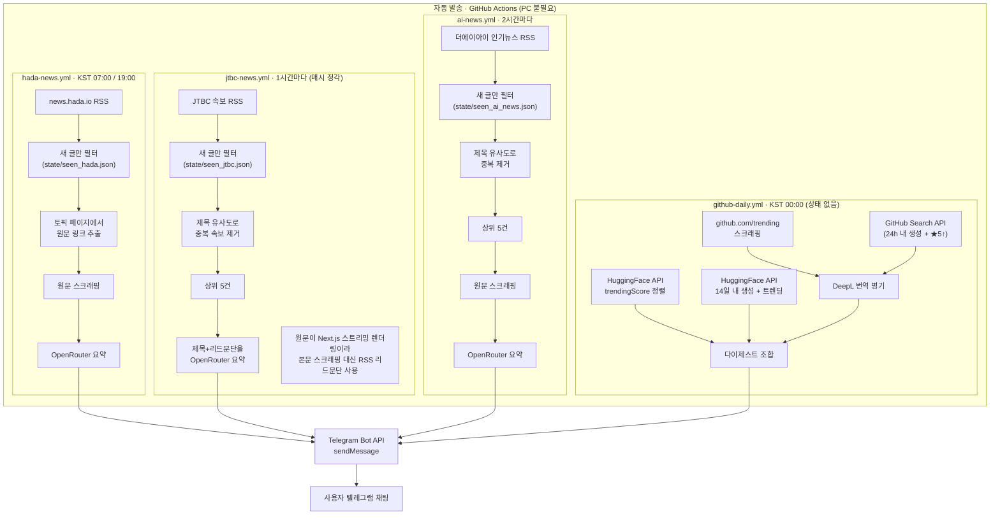

# 아키텍처

이 저장소는 텔레그램 봇 하나(`@treewind_wiki_news_bot`)가 **GitHub Actions 4종**으로
정해진 주기에 뉴스/트렌드를 수집·요약해 먼저 말을 걸어오는 구조입니다. 전부 GitHub
클라우드에서 실행되므로 PC가 꺼져 있어도 동작하며, 같은 텔레그램 봇·같은 채팅
(`TELEGRAM_CHAT_ID`)으로 보냅니다.

저장소는 **public**입니다. GitHub Actions는 public 저장소에서 표준 러너 기준 실행
시간이 완전 무료(무제한)라, 실행 빈도 때문에 과금될 걱정 없이 자유롭게 스케줄을
잡을 수 있습니다. (private였다면 월 2,000분 무료 한도가 있어 `jtbc-news`처럼
잦은 워크플로우가 한도에 걸릴 수 있었습니다.)

## 전체 흐름도

## 구성 요소 요약

| 이름 | 트리거 | 스크립트 | 소스 | 요약 방식 | 상태 파일 |
|---|---|---|---|---|---|
| hada-news | KST 매일 07:00, 19:00 | `scripts/fetch_hada_news.py` | [news.hada.io](https://news.hada.io) (GeekNews) RSS | 원문 스크래핑 후 OpenRouter 요약 | `state/seen_hada.json` |
| jtbc-news | 1시간마다 | `scripts/fetch_jtbc_news.py` | JTBC 속보 RSS | RSS 리드문단을 OpenRouter 요약 | `state/seen_jtbc.json` |
| ai-news | 2시간마다 | `scripts/fetch_ai_news.py` | 더에이아이(newstheai.com) 인기뉴스 RSS | 원문 스크래핑 후 OpenRouter 요약 | `state/seen_ai_news.json` |
| github-daily | KST 매일 00:00 | `scripts/fetch_github_daily.py` | GitHub Trending, GitHub Search API, HuggingFace API | 요약 없음(트렌딩 목록), DeepL로 설명 번역 | 없음(중복 방지 불필요) |

## 중복 방지 (state 파일)

`hada-news` / `jtbc-news` / `ai-news`는 매 실행마다 다음을 반복합니다.

1. RSS를 읽어 `state/seen_*.json`에 없는 항목만 "새 글"로 판단
2. 새 글을 처리(원문 수집 → 요약 → 발송)
3. 이번에 확인한 모든 항목의 ID를 seen 목록에 추가하고, 오래된 것부터 잘라 `MAX_SEEN` 이내로 유지
4. 워크플로 마지막 단계에서 갱신된 `state/seen_*.json`을 저장소에 커밋·푸시

**최초 실행은 발송하지 않습니다.** 처음 켜는 순간 피드에 있는 기존 글을 전부 "새 글"로 오인해
한꺼번에 쏟아보내는 것을 막기 위해, 첫 실행은 seen 목록만 채우고 발송은 건너뜁니다.

### 동시 실행 시 커밋 경합

세 워크플로우의 스케줄이 겹치는 시각(예: UTC 22:00, 10:00에는 hada-news와 jtbc-news가 동시 실행)이
있어, 서로 다른 `state/seen_*.json`을 커밋하더라도 같은 `main` 브랜치에 동시에 푸시하면
먼저 푸시한 쪽 이후엔 나머지가 실패할 수 있습니다. 이를 막기 위해 각 워크플로우의 상태 커밋
단계는 push 실패 시 `git fetch` + `git rebase` 후 최대 5회 재시도합니다.

## 원문 스크래핑이 안 되는 경우의 폴백

사이트마다 본문을 안정적으로 긁어올 수 있는지가 다릅니다.

- **news.hada.io**: 토픽 페이지(`a.topic-title-link`)에서 실제 출처 링크를 찾아 그 원문을 긁어옵니다.
- **더에이아이(newstheai.com)**: 일반적인 서버 렌더링 HTML이라 `
` 태그 기반 추출이 안정적으로 동작합니다.
- **JTBC**: 기사 페이지가 Next.js 스트리밍 렌더링(`self.__next_f.push`)이라 정적 HTML에 본문이
  없어 안정적으로 긁어올 수 없습니다. 그래서 원문 스크래핑을 시도하지 않고 RSS의 제목+리드문단을
  그대로 LLM에 넘겨 요약합니다.

원문 스크래핑이나 LLM 요약이 실패하면(네트워크 오류, 요청 한도 초과 등) 항상 RSS 자체의
설명(description)으로 폴백해 발송 자체는 끊기지 않도록 합니다.

## 필요한 GitHub Secrets

| Secret | 사용처 |
|---|---|
| `TELEGRAM_BOT_TOKEN` | 전 구성 요소 공통 |
| `TELEGRAM_CHAT_ID` | 전 구성 요소 공통 |
| `OPENROUTER_API_KEY` | hada-news, jtbc-news, ai-news |
| `DEEPL_API_KEY` | github-daily (선택 — 없으면 번역 없이 원문만 발송) |

`GITHUB_TOKEN`은 GitHub Actions가 자동으로 제공하는 시크릿으로, github-daily에서
Search API 호출 한도를 높이는 데만 쓰이고 별도 등록이 필요 없습니다.

## 알려진 제약

- GitHub Actions 스케줄은 부하에 따라 수 분~수십 분 밀릴 수 있습니다(정시 도착 보장 안 됨).
- ai-news, jtbc-news의 중복 제거는 제목 문자열 유사도(`difflib.SequenceMatcher`, 임계값 0.6)
  기반이라 완전히 다른 표현의 같은 사건은 걸러지지 않을 수 있습니다.

## 변경 기록

- **2026-09-04**: 기존 RSS/arXiv 일간 브리핑 파이프라인(`collect.py`, `daily-brief.yml`,
  `briefs/`, `sources.yml`)을 전부 제거하고, URL 요약 대화형 봇(`bot.py`)으로 전환
- **2026-09-04**: `hada-news`(GeekNews) 추가 — 이후 원문 스크래핑 + OpenRouter 요약,
  실행 시각을 KST 07:00/19:00으로 조정
- **2026-09-04**: `github-daily` 추가 — GitHub 트렌딩 TOP5 + 신규 저장소 TOP3, 이후
  DeepL 번역 병기와 HuggingFace 트렌딩 모델 섹션(TOP5 + 최근 14일 TOP3) 추가
- **2026-09-04**: `jtbc-news`(JTBC 속보) 추가 — 제목 유사도 중복 제거 + 상위 5건 요약
- **2026-09-04**: `ai-news`(더에이아이 인기뉴스) 추가 — 동일하게 중복 제거 + 상위 5건
  원문 요약
- **2026-09-04**: 전체 점검 후 두 가지 버그 수정 — 워크플로우 동시 실행 시 `git push`
  경합, seen 상태 트리밍 시 순서 미보장(set → list)
- **2026-09-04**: PC 상시 실행이 필요했던 `bot.py`(URL 요약 대화형 봇) 제거. 이제
  전부 GitHub Actions 4종만으로 구성되어 PC 상태와 무관하게 동작
- **2026-09-05**: private 저장소의 GitHub Actions 월 2,000분 무료 한도에 근접할
  것으로 추산되어(`jtbc-news`의 잦은 실행이 주요 원인) 저장소를 **public으로 전환**.
  이에 따라 Actions 실행 시간이 완전 무료가 되어, 비용 절감을 위해 낮췄던 `jtbc-news`
  주기(30분 → 1시간)는 필요시 원래대로 되돌릴 수 있음
